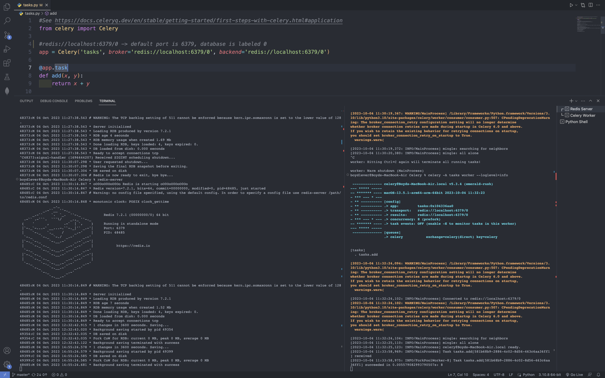

# Description
This application is designed to perform asynchronous task processing using Celery, backed by Redis.
# What is Celery?
Celery is a distributed task queue system. In simple terms, it allows you to execute tasks asynchronously, outside of your main application flow. This can be particularly useful for long-running tasks, such as sending emails, processing large amounts of data, or any other operation that you don't want to perform in real-time within the main thread of your application. Celery supports scheduling tasks, retrying failed tasks, and executing tasks across multiple machines, making it scalable and resilient. 
# What role does Redis play?  
In the context of this application, Redis serves two primary roles:  

Message Broker: Celery requires a solution to send and receive messages, effectively communicating what tasks need to be executed. Redis, in this setup, acts as the message broker. When a task is queued up for execution, a message is sent to Redis. Celery workers then pick up these messages from Redis and execute the tasks.

Result Backend: Once tasks are completed, the results need to be stored somewhere, especially if the main application wants to check the outcome of an asynchronous task. Redis is also used as a result backend, storing the results of tasks that have been processed by Celery. This allows the application to query Redis for the outcome of a task, be it a successful result, an error, or any other status information.  

# Screenshot

